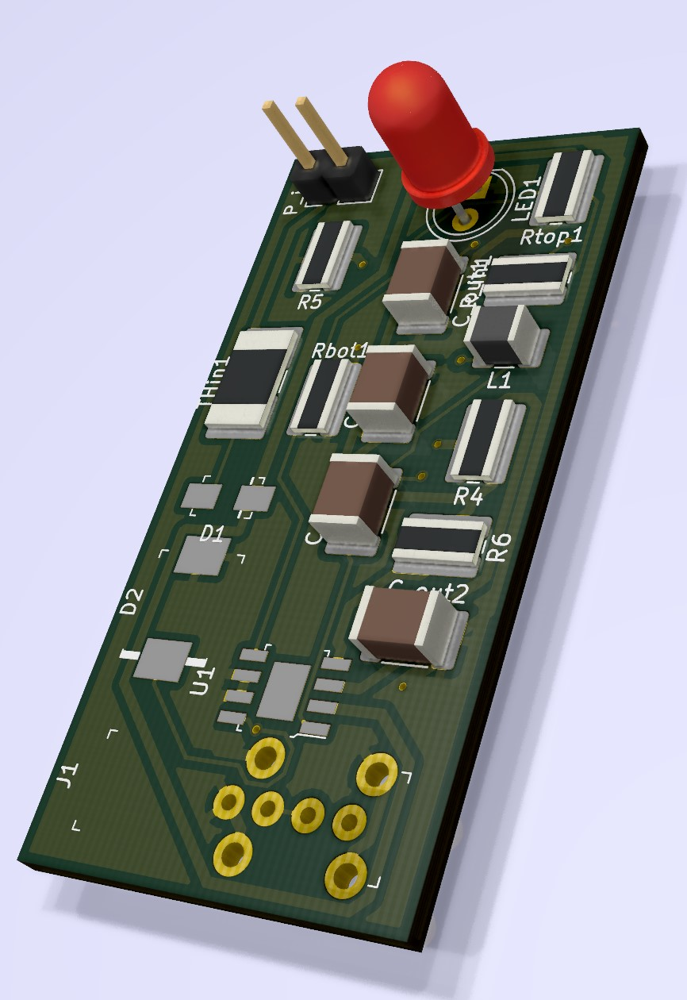
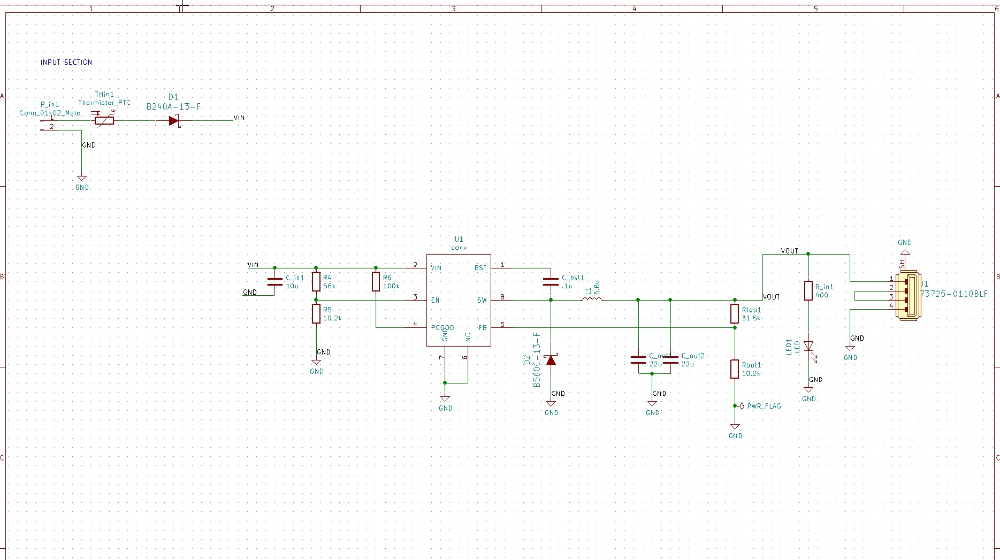
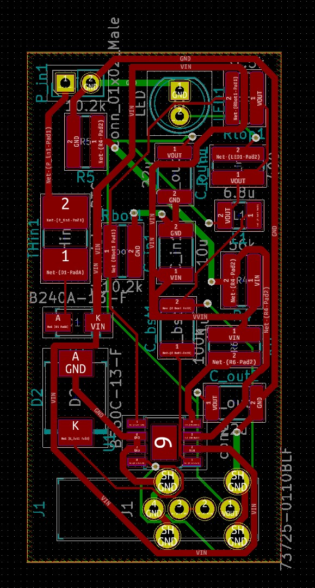

# USB-Charger
Takes input of 9-18V DC and outputs power compliant with USB Battery Charging 1.2.  
[BOM](https://github.com/lzyang2000/PCB-Projects/blob/master/USB-Charger/USB%20Charger%20BOM.csv)

